# Eclipse

A game by Team Saturday (Canvas Team #14)

- Durukan Butun (23857824)
- Nanjou Olsen (59393686)
- Alan Zheng (18887208)
- Chowdhury Zayn Ud-Din Shams (46176756)
- Han Kim (45508413)
- Will Beaulieu (24994386)
- Nishant Molleti (21147343)

## Overview

Eclipse is a top-down, horde survival shooter, revolving around the story of a character who has crash-landed on an alien planet perpetually eclipsed in darkness.
Their goal is to escape the shadow of the eclipse being cast on the planet by another celestial body by defeating the hostile aliens that get in their way.

Our twist on the horde survival genre is our realistic lighting system, which immerses the player in the world of the game.

## User Inputs

Main Controls
- `W`/`A`/`S`/`D`: Move player up/left/down/right
- `MOUSE`: Aim flashlight and gun
- `LEFT CLICK`: Shoot gun
- `R`: Reload gun
- `E`: Interact with world elements
- `LSHIFT`: Dash
- `ESCAPE`: Return to main menu

Bonfire controls
- `I`: Open inventory
- `N`: Proceed to next level

Debug Controls
- `C`: Show circular and mesh-based bounding boxes of the player.
- `G`: Re-generate world
- `B`: Trigger Boss Battle
- `=`: Restart game
- `CTRL + R`: Refresh UI

## Proposal

Eclipse by Team Saturday: [proposal.pdf](doc/proposal.pdf)

## Milestone 4

### Update since M3

A new rifle weapon was added, and all weapons can now be upgraded.

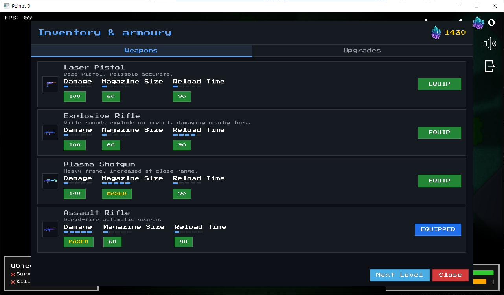

Replaced the old armor system with a new upgrade system.
When hovering with the mouse, each upgrade shows a tooltip explaining what it does.

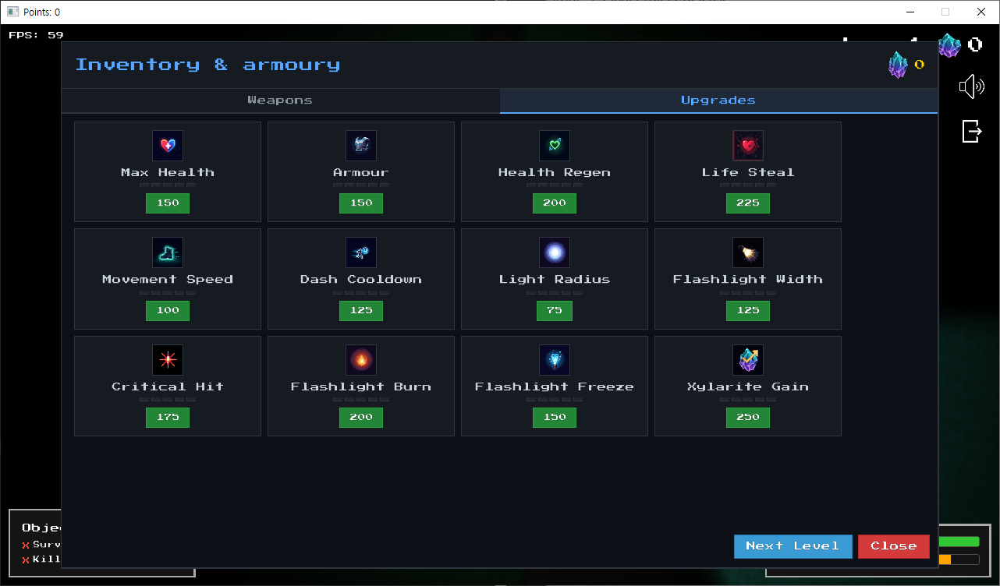

Added item drops: **Xylarite** increases the currency by 10 (without any upgrades), and the **First Aid Kit** restores health.

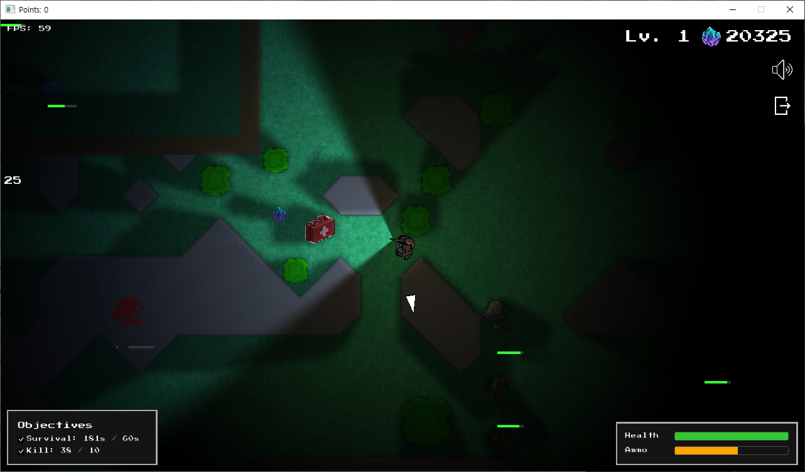

Added more types of enemies.

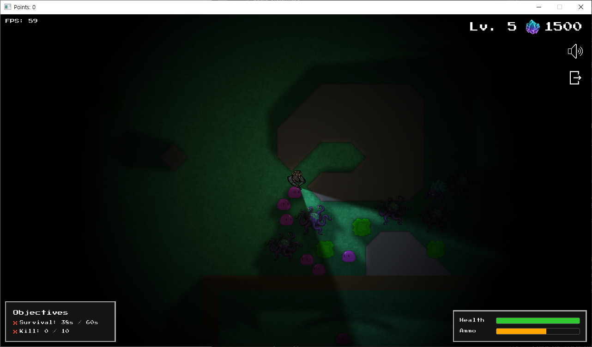

Added a Boss enemy with various attack patterns and mechanics.

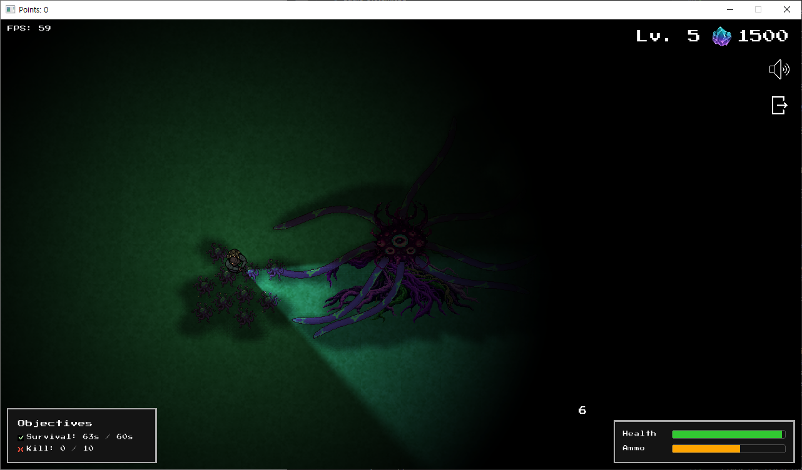

### Required Elements

#### `[1] Playability`
- Added the following new features to ensure non-repetitive gameplay for at least 10 minutes:
	- A new Boss enemy and several additional enemy types.
	- Level scaling, upgrade options, and a new weapons that introduce continuous new content.

#### `[2] Stability`
- Our open issues are [here](https://github.students.cs.ubc.ca/CPSC427-2025W-T1/team14/issues)
- Our closed issues are [here](https://github.students.cs.ubc.ca/CPSC427-2025W-T1/team14/issues?q=is%3Aissue+is%3Aclosed)

#### `[3] User Experience`
- The game includes an introductory tutorial that teaches all core mechanics when the player starts.
- Overall gameplay is simple and intuitive, requiring no external explanation.
- Objectives are straightforward and easy to understand.
- Based on peer-review feedback, the minimap was removed and replaced with a more intuitive directional arrow for better clarity.

#### `[4 - 1] Robustness : Memory management`
- We profiled our game with the CRT debugging tool, and collected results about memory leaks.

#### `[4 - 2] Robustness : User Input`
- Fixed the crash that occurred when minimizing the window and confirmed correct behavior through testing.

#### `[4 - 3] Robustness : Realtime Performance `
- Confirmed that the Release build runs smoothly on both macOS and Windows with no noticeable stutter or slowdown.

#### `[5] Reporting`
- We identified and fixed a bug where the sprited enemy was not properly tracking the player.

### Creative Elements

#### `[Advanced] Graphic: Skinned motion`
- The Boss enemy has **8 tentacles**, each with **16 bones**, allowing smooth motion and precise collision.
- Implemented a custom skinned-motion system using bone data extracted from **DragonBones**’ rig JSON.
- Bones accumulate local rotation, creating natural bending and animation.

#### `[Advanced] Graphics: Particle System`
- Implemented a particle system using **instancing** to render many particles efficiently.
- Supports simple parameters like velocity and lifetime for versatile effects.
- Used for blood effects, the Boss enemy’s beam attack, and other visual effects.

#### `[Advanced] Artificial Intelligence: Swarm Behaviour`
- During the boss battle, the Boss spawns minions that move using separation, cohesion, alignment, and center-following rules.
- Minions react dynamically, scattering or shifting when another minion dies.
- Each minion updates its velocity based on nearby swarm members, creating natural group movement.

## Milestone 3

### Current Game State

In our Advanced Game Release, we added several new features and polish elements that make the game more engaging and complete.

The most notable addition is the new Main Menu Screen.

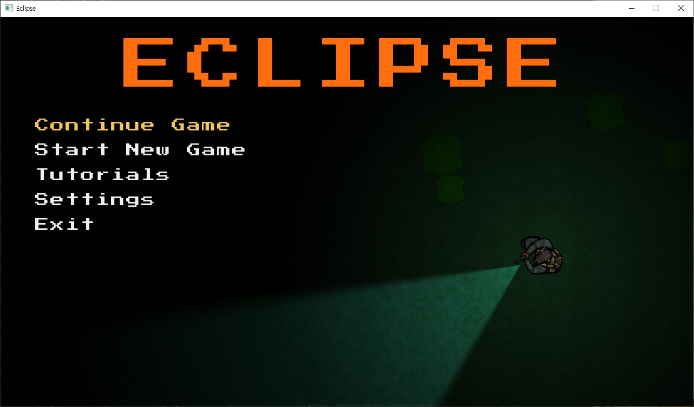

The left side contains the menu options, and the right side shows a semi-interactive player character that turns toward the mouse cursor.

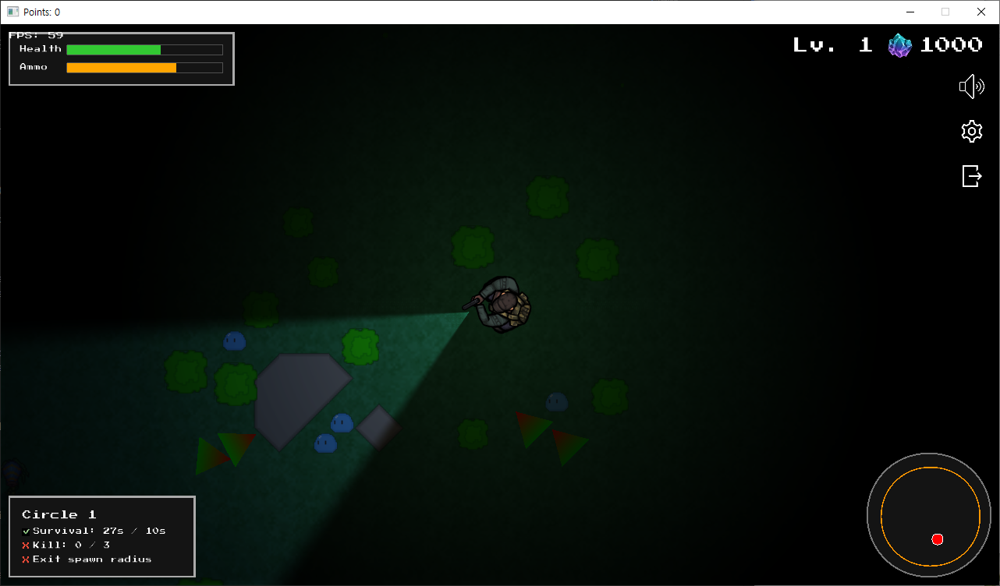

Inside the game, several major visual updates were made.  
A background now exists, additional obstacle types have been added, and trees now have size variants to create more natural visual variety.  
(In our final build, the background is disabled, since it prevents occlusive shadows from appearing.)

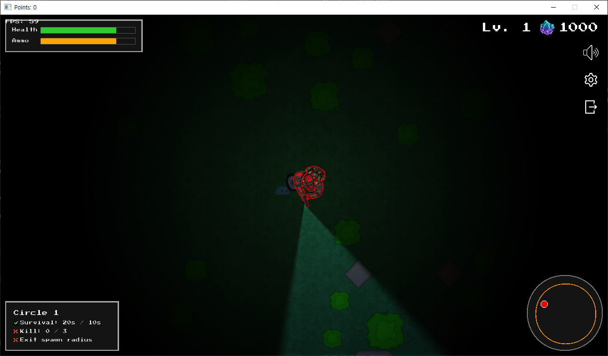
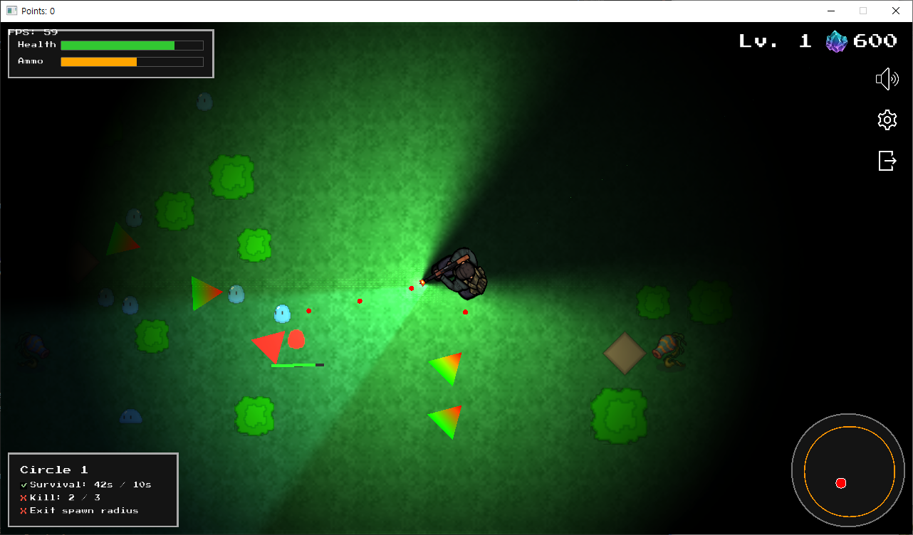

Based on feedback from the cross-play session, we implemented knockback for both the player and enemies when taking damage.  
Both the player and enemies briefly flash red on hit, and a temporary enemy health bar now provides clearer visual feedback.  
These additions make combat feel more readable and dynamic.

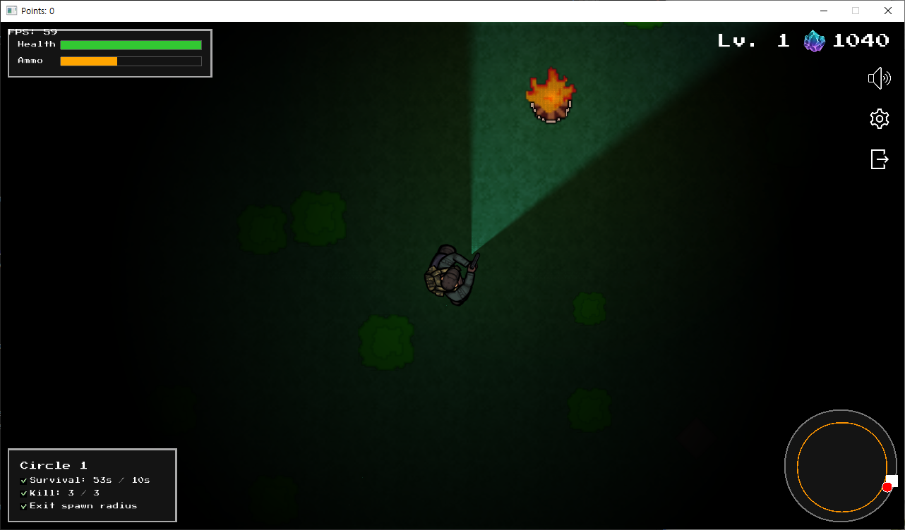
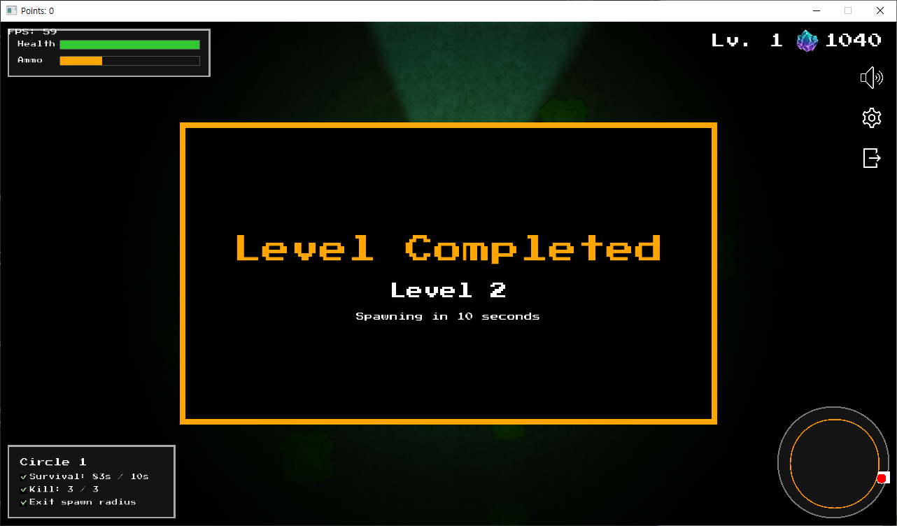
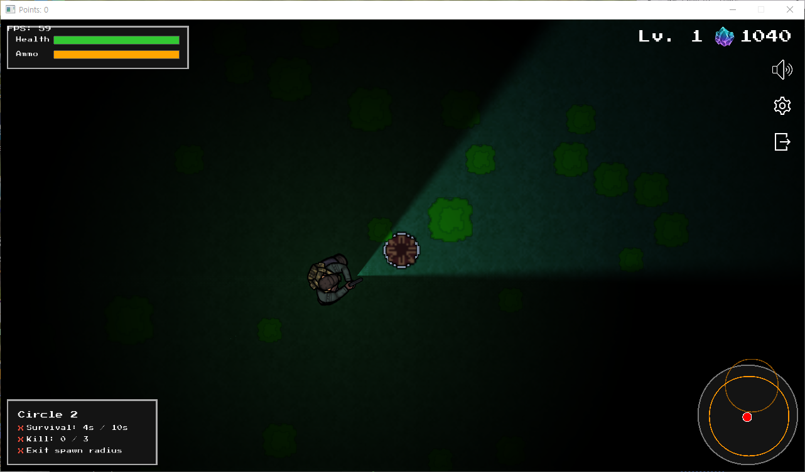

The campfire objective is now partially implemented.  
Players can interact with the campfire, and the basic gameplay loop is becoming more complete.  
Although the transition is still slightly glitchy, the feature for progressing to the next level is already implemented, so the next milestone will mainly focus on refining the interaction.

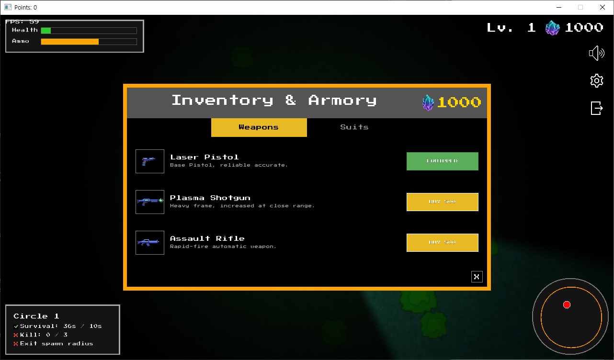
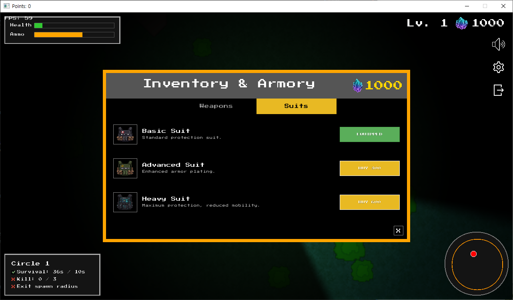

The UI has also been upgraded.  
The minimap now has a more polished player icon, campfires are displayed on the map, and the inventory UI now includes item icons.

### Required Elements

#### `[1] Playability: 5 minutes of non-repetitive gameplay`
- We added many new features that make the gameplay non-repetitive, including:
  - New obstacle types and tree size variants  
  - A partially implemented campfire objective that progresses the level  
	- Multiple weapon types that change the player's combat pattern  

#### `[2] Robustness: Memory management`
- Our game cleans up all allocated memory when closed

#### `[3] Robustness: Handle all user input`
- Our game only checks for specific keystrokes and user inputs: any inputs apart from those are not registered
- When tabbed out, the game continues to run normally

#### `[4] Robustness: Real-time gameplay`
- We capped the game at 60 FPS to prevent unstable movement and excessive frame spikes.  
- In most situations the game maintains a stable 60 FPS, and there are no noticeable areas with significant frame drops.

#### `[5 - 1] Stability: Prior missed milestone features & bug fixes.`
- We identified and fixed a bug where the sprited enemy was not properly tracking the player.

#### `[5 - 2] Stability: Consistent game resolution.`
- The game renders at 1280 x 720 on both Mac and Windows
- Legibility of certain game elements is poor on Windows, due to the GUI being designed to be displayed on retina monitors

#### `[5 - 3] Stability: No crashes, glitches, unpredictable behaviour.`
- We ensured that our game does not crash by using AddressSanitizer (`-fsanitize=address`), which allowed us to detect and fix several memory-related issues.
- There is a known issue that causes the game to crash during shutdown on Mac: we have identitifed, but not tested, a potential fix

#### `[6] README: All README sections and sub-sections above are completed as described.`
- All README sections have been completed

#### `[7] Software Engineering: Updated test plan - updated list of player or game actions and their excepted outcomes.`
- Our test plan is [here](doc/test-plan.pdf)

#### `[8] Reporting Updated bug list - includes open and closed bugs.`
- Our open issues are [here](https://github.students.cs.ubc.ca/CPSC427-2025W-T1/team14/issues)
- Our closed issues are [here](https://github.students.cs.ubc.ca/CPSC427-2025W-T1/team14/issues?q=is%3Aissue+is%3Aclosed)

### Creative Elements

#### `[16] Game AI: Swarm behaviour`
- Enemies use an adapted version of BOIDS to flock together and avoid each other while pathfinding towards the player

#### `[19] Software Engineering: Reloadability`
- Everytime the user presses escape and opens the menu, the games state is saved to a file.
- Game state includes the map, player health, guns. 
- Game state excludes enemies.
- Upon opening the game, if there is a valid save file the player can press 'continue game' to load from file.

#### `[21] UI & IO: Camera Controls`
- After starting the game, the camera smoothly transitions to center on the player sprite
- While playing the game, the camera follows the player
- When the player interacts with a campfire, the camera smoothly transitions so that it is centered on the campfire, and smoothly transitions back to the player once they leave it

#### `[23] UI & IO: Audio Feedback`
- Various game actions have audio feedback: shooting and reloading the gun, hitting enemies and obstacles, and getting hurt
- Ambient music plays in the background of the game
- Audio can be toggled on and off using the HUD

<!-- TODO: determine other M3 creative elements -->
<!-- Procedural generation may not be valid: check with Kagan for M4 -->
<!-- If swarm merged, add as last creative element: check with Kagan for M4 -->

## Milestone 2

### Current Game State

Our minimally playable game uses a more advanced (and accurate) lighting system, and features more of the core components of the game.

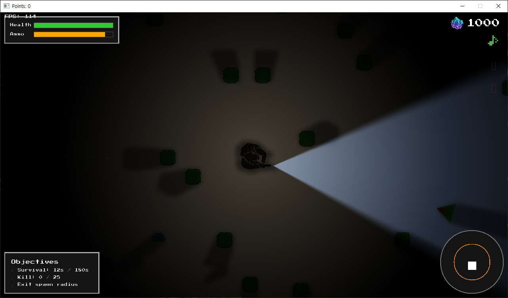

The game now features a fully integrated HUD system with multiple new UI elements.
- An interactive tutorial responds to player actions and game state to help the player learn the mechanics of the game. For example, the reload tutorial only appears after the player runs out of ammo, teaching mechanics contextually rather than overwhelming the player with information upfront.
- HUD elements include the minimap, objective tracker, currency display, stats display, and FPS counter integrated into the game screen

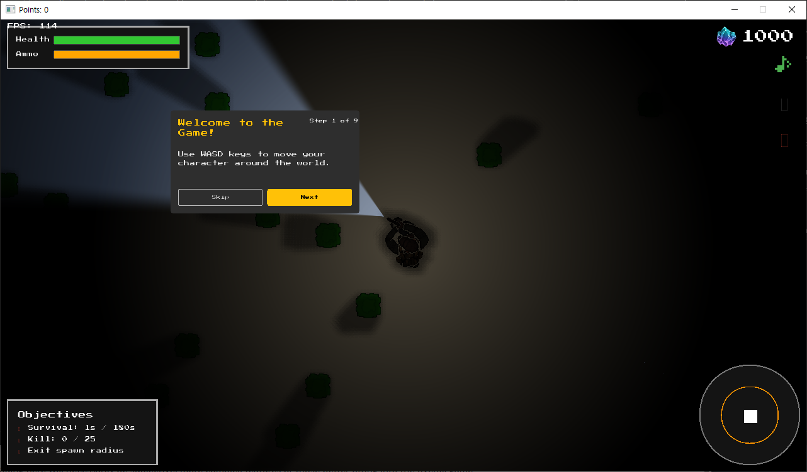

The player now has a mesh-based bounding box, used to register when enemies hit the player.
- Circular bounding box collisions are used for physics calculations where entities "push" each other, and for collisions with trees (world objects) that stop entities
- Press "C" to toggle both bounding boxes of the player (mesh-based in red and circular in blue)

The game's world is now practically infinite: new "chunks" of the world will be generated as the player moves away from their starting point.
- World chunks use thresholded perlin noise to determine which areas obstacles can be placed into, and obstacles are then placed randomly in those areas such that they do not overlap with the player or other obstacles in the current chunk
- To ensure that the game still runs smoothly when large amounts of world data have been created, generated world chunks are serialized into a more space-efficient format when they go off screen, and are re-populated when they come back on screen

The game now has a dynamic camera that follows the player as they move around the world, enabling the player to explore more than what's inside the starting screen area.

Bonfires have been added as interactive light sources that dynamically illuminate their surroundings.  
- A new spawning system automatically creates bonfires when the player travels a certain distance away from the starting area, providing visual variety and a sense of progression as the player explores.  
- Players can interact with bonfires by pressing `E`, which may trigger future gameplay mechanics such as resting or saving.

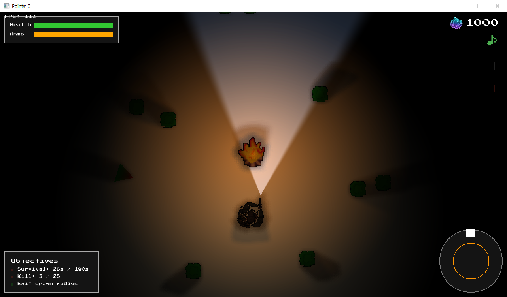

A new enemy type, **Evil Plant**, has been added.  
- Unlike other enemies, it remains stationary but attacks the player by shooting projectiles.  
- This introduces ranged combat mechanics and encourages the player to move strategically during encounters.

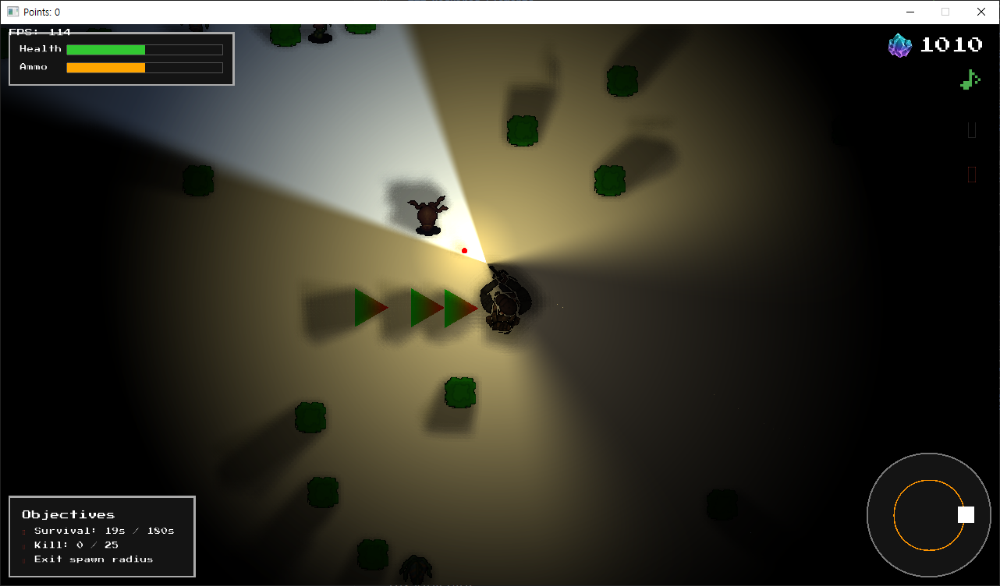

### Required Elements

#### `[1] Game AI: Game logic response to user input`
- A pathfinding algorithm was implemented for GreenTriangle enemies, allowing them to navigate around obstacles (currently only trees) instead of moving in straight lines.
- The newly added Evil Plant enemies utilize a state machine–based decision tree to control their behavior.

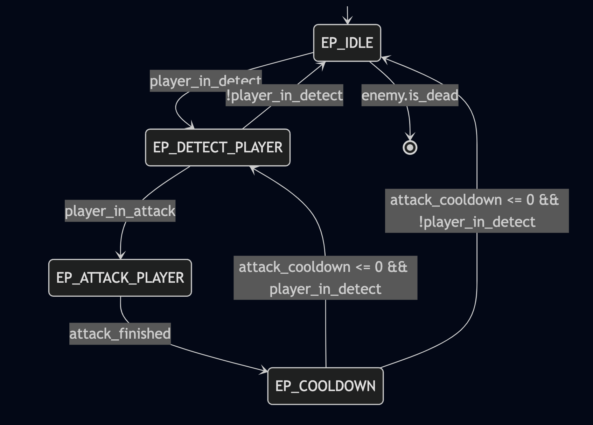  

 - Explanation for graph:
    - In the `EP_IDLE` state, the enemy remains stationary.  
    - When the player enters its detection range, it transitions to `EP_DETECT_PLAYER`.  
    - If the player gets closer, the state changes to `EP_ATTACK_PLAYER` to perform an attack.  
    - After attacking, it enters `EP_COOLDOWN` and waits until the cooldown finishes.  
    - Once the cooldown ends, it returns to either `EP_IDLE` or `EP_DETECT_PLAYER`, depending on whether the player is still within the detection range.

#### `[2] Animation: Sprite sheet animation`
- The player, slime enemy, evil plant enemy and bonfire sprites are animated using spritesheets

#### `[3] Assets: New integrated assets`
- The player model is textured with newly-added spritesheets
- The evil plant is textured with newly-added spritesheets
- Sounds (background music and gun noises) have been integrated into the game

#### `[4] Gameplay: Mesh-based collision detection`
- Player-to-enemy collisions are mesh-based: the player's mesh is compared with the enemy's circular bounding box to determine if the player should take damage

#### `[5] Gameplay: Base user tutorial/help`
- **Interactive tutorial system** that responds to player actions and game state
- Tutorial messages appear contextually (e.g., reload tutorial only shows after running out of ammo)
- Teaches core mechanics: movement, shooting, reloading, inventory, and objectives
- Provides real-time feedback to guide new players through the game

#### `[6] Improved Gameplay: FPS counter`
- FPS counter displayed on the game screen (not just in window title)
- Provides real-time performance feedback during gameplay

#### `[7] Playability: 2-minutes of non-repetitive gameplay`
- The player can explore, fight multiple enemy types, and interact with bonfires for over two minutes of continuous gameplay.  
- Enemy waves scale in difficulty over time, ensuring that gameplay remains dynamic rather than repetitive.  
- Different enemy behaviors (pathfinding GreenTriangles and state-driven Evil Plants) create varied combat encounters.  
- The player must move strategically, manage ammo, and react to changing threats throughout the session.

#### `[8] Stability: Minimal lag`
- Our game consistently runs at around 70 FPS on a dedicated gaming laptop (13th-gen Intel i7 CPU, Nvidia RTX 4060 GPU, 16GB RAM), with higher framerates when less chunks are loaded to the screen
- Our game may lag on lower-end devices due to our advanced lighting system and infinite world generator

#### `[9] Stability: No crashes, glitches, or unpredictable behaviour`
- Crash-causing issues that we have identified have been fixed
- There may still be occasional undesired behaviours due to non-urgent bugs that have been identitfied but not yet fixed

#### `[10] README: All README sections and sub-sections above are completed as described`
- All README sections are complete.
  
#### `[11] Software Engineering: Test plan that covers game play and excepted outcomes`
- Our test plan is [here](doc/test-plan.pdf)

#### `[12] Reporting: Using GitHub Issues, record any bugs`
- Our open issues are [here](https://github.students.cs.ubc.ca/CPSC427-2025W-T1/team14/issues)
- Our closed issues are [here](https://github.students.cs.ubc.ca/CPSC427-2025W-T1/team14/issues?q=is%3Aissue+is%3Aclosed)

### Creative Elements

#### `[7] Graphics: 2D Dynamic Shadows (Advanced)`

Real-time dynamic shadow system where lights cast realistic shadows based on obstacle positions. Shadows update every frame as entities and lights move through the scene. I originally implemented radiance cascades, but was unable to achieve the look and feel I wanted. Radiance Cascades is much better suited for brighter scenes with many sources of light. I kept some of the radiance cascade pipeline (Computing a signed distance field) and used it to more efficiently cast soft, dynamic shadows. 

- **Implementation Details:**
  - **SDF Generation:** Signed Distance Field texture computed for all obstacles, encoding the distance to the nearest obstacle at every screen pixel
  - **Ray Marching:** GPU-accelerated sphere tracing in fragment shader ([point_light.fs.glsl:20-88](shaders/point_light.fs.glsl#L20-L88))
  - **Soft Shadows:** Multi-ring sampling creates soft penumbra.
  - **Light Height:** Distance-based shadow length calculations simulate 3D lighting in 2D space.
  - **Performance:** SDF acceleration structure allows real-time performance at 60 FPS with multiple dynamic lights

- **Technical Approach:**
  - Precompute SDF texture each frame for all static and dynamic obstacles
  - For each pixel, cast 16 shadow rays from offset positions toward the light
  - Use sphere tracing to efficiently march through the SDF until hitting geometry
  - Accumulate visibility samples and apply distance-based shadow falloff

## Milestone 1

### Current Game State

In our skeletal prototype, many entities still use placeholder meshes, with a few sprites included to test/demonstrate how sprite rendering works.

The circular pink mesh represents the player, and the blue rectangle represents both the gun and the flashlight. Lighting and occlusive shadow effects are applied to entities, as shown above.

The player can aim the flashlight and gun with the mouse and shoot red circular bullets using the left mouse button, as shown above.

The green triangle is a placeholder enemy, while the slime shown above tests/demonstrates sprite animation applied to enemies. Shooting these enemies with bullets kills them and triggers a death animation.  
**Note**: These screenshots were taken with ambient lighting enabled for better visibility.

The three screenshots above show the current state of our world generation.  
At the moment, the only world element is the **tree**, which has a sprite applied.  
Each time the game starts, trees are placed at random, non-intersecting positions in the world. This effectively generates a new world every time the game is launched.

(World element collision is not yet implemented, so these elements are purely decorative right now.)

  
  

Pressing **I** opens the inventory UI.  
A basic purchase and equipment system has been implemented and can be accessed through this UI.  
The player starts with **$812** for testing purposes and can use the UI to purchase or equip items.  

(The equipment itself is not yet implemented, so equipping items does not cause any changes right now.)

### Required Elements

#### `[1] Rendering: Textured geometry`
- The enemy "Slime" uses a 6 frame sprite sheet for its animation
- The randomly-placed trees in the world are rendered using a single sprite

#### `[2] Rendering: Basic 2D transformations`
- The placeholder enemy faces and follows the player
- The placeholder enemy spins and shrinks during its death animation

#### `[3] Rendering: Key-frame/state interpolation`
- The movement and rotation of the placeholder enemy is calculated with respect to `elapsed_ms`, the enemy's position, and the player's position
- The slime enemy's current animation frame is calculated respect to `elapsed_ms`
  
#### `[4] Gameplay: Keyboard/mouse control`
- The player uses the WASD keys to move around the world, and the I key to open the inventory
- The player uses the mouse to aim the flashlight, and left-click to shoot a bullet

#### `[5] Gameplay: Random/coded action`
- All enemies are coded to face and move towards the player
- All trees are placed at random positions in the world
  
#### `[6] Gameplay: Well-defined game-space boundaries`
- The player can not move beyond the window border
- Obstacles are not generated outside of the window border

#### `[7] Gameplay: Simple collision detection & resolution (e.g. between square sprites)`
- Enemies die when hit by bullets

#### `[8] Stability: Stable frame rate and minimal game lag`
- Our game runs smoothly on sufficiently-powerful hardware
- Our game may lag on lower-end devices due to our advanced lighting systems

#### `[9] README: All README sections and sub-sections above are completed as described`
- All sections and sub-sections are completed
  
#### `[10] Software Engineering: Test plan that covers game play and excepted outcomes`
- Our test plan is [here](doc/test-plan.pdf)

#### `[11] Reporting: Using GitHub Issues, record any bugs`
- Our open issues are [here](https://github.students.cs.ubc.ca/CPSC427-2025W-T1/team14/issues)
- Our closed issues are [here](https://github.students.cs.ubc.ca/CPSC427-2025W-T1/team14/issues?q=is%3Aissue+is%3Aclosed)
  
### Creative Elements

#### `[1] Graphics: Simple Rendering Effects (Basic)`
**Techniques:** Fragment shader color manipulation  
Making the fragments in the player view-cone brighter, along with fading out the brightness based on distance and angle.

#### `[7] Graphics: 2D Dynamic Shadows (Advanced)`
**Techniques:** Basic shadow mapping, ray-object intersections  
Added dynamic shadows that move with entities. Uses raymarching to check occlusions. An entity can be marked as an occluder by adding the occluder component.  
Press 'o' to view the occlusion mask.

#### `[20] Software Engineering: External Integration (Basic)`
**Techniques**: CMake knowledge  
We are using `RmlUi` to create our inventory UI, so we have integrated it (as well as `FreeType`) into our project.

## References and Notes

Total grace days used: 3 (1 for M1, 1 for M2, 1 for M3)

Source for the slime sprite sheet: https://pixelmikazuki.itch.io/free-slime-enemy  
Source for the player sprite: https://opengameart.org/content/animated-top-down-survivor-player

Sources referenced for Perlin noise implementation:
- Ken Perlin's 2002 paper about improvements to the original Perlin noise algorithm: https://doi.org/10.1145/566654.566636
- An archived slide deck by Ken Perlin about the original Perlin noise algorithm: https://web.archive.org/web/20071008162042/http://www.noisemachine.com/talk1/index.html
  - Sourced from https://en.wikipedia.org/wiki/Perlin_noise
- Perlin noise algorithm explanation by Raouf, including a reference implementation: https://rtouti.github.io/graphics/perlin-noise-algorithm
- Perlin noise algorithm explanation by Adrian, including a reference implementation: https://adrianb.io/2014/08/09/perlinnoise.html
