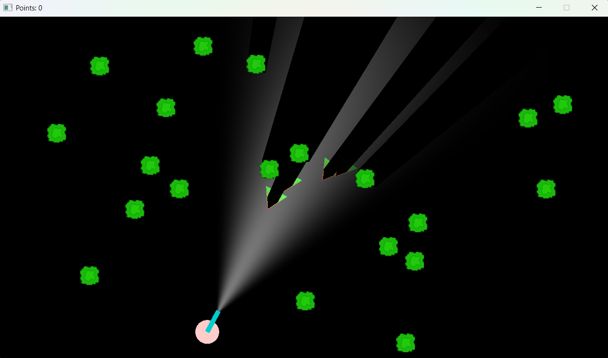
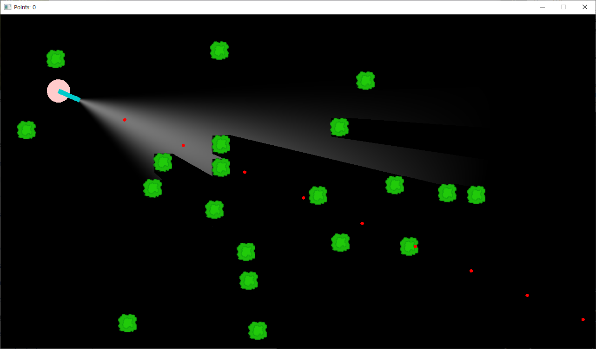
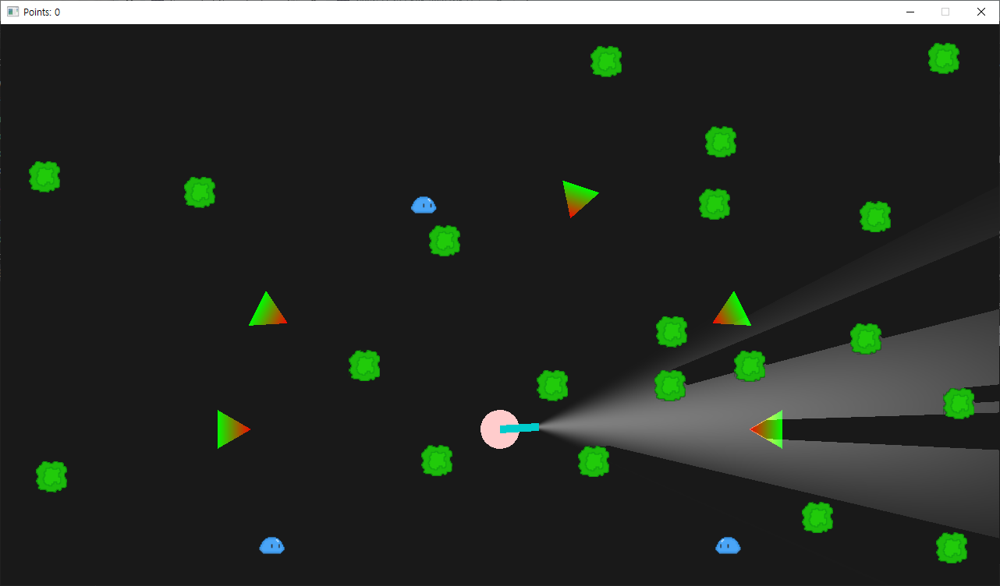
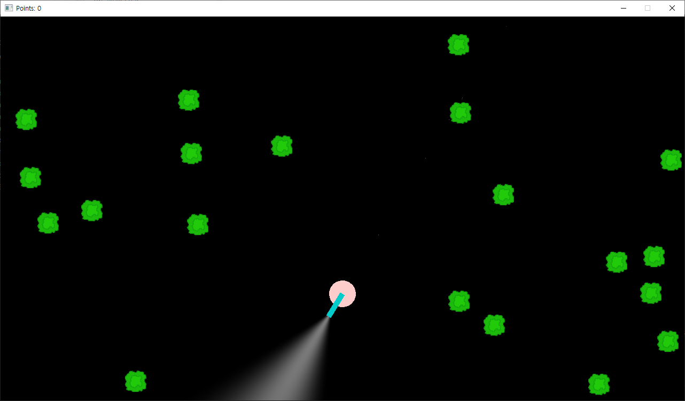
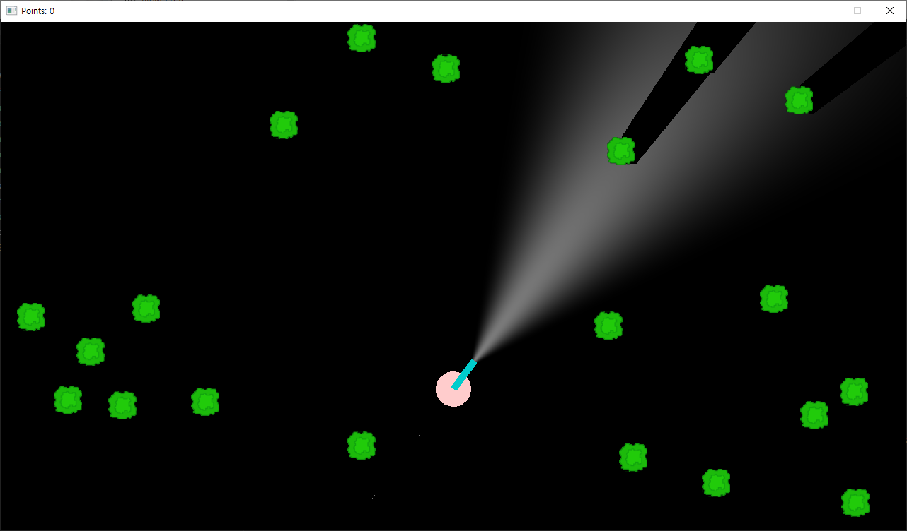
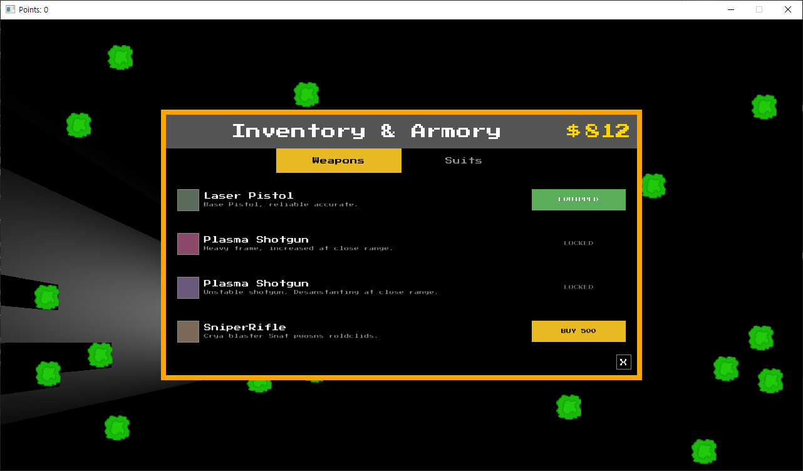
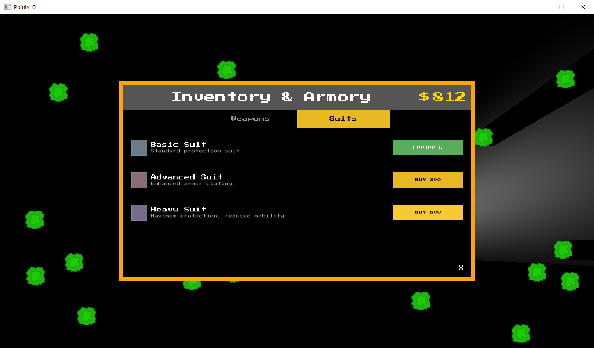

# Eclipse

A game by Team Saturday (Canvas Team #14)

- Durukan Butun (23857824)
- Nanjou Olsen (59393686)
- Alan Zheng (18887208)
- Chowdhury Zayn Ud-Din Shams (46176756)
- Han Kim (45508413)
- Will Beaulieu (24994386)
- Nishant Molleti (21147343)

## Overview

Eclipse is a top-down, horde survival shooter, revolving around the story of a character who has crash-landed on an alien planet perpetually eclipsed in darkness.
Their goal is to escape the shadow of the eclipse being cast on the planet by another celestial body by defeating the hostile aliens that get in their way.

Our twist on the horde survival genre is our realistic lighting system, which immerses the player in the world of the game.

## User Inputs

Main Controls
- `W`/`A`/`S`/`D`: Move player up/left/down/right
- `MOUSE`: Aim flashlight and gun
- `LEFT CLICK`: Shoot gun
- `R`: Reload gun
- `I`: Open inventory
- `LSHIFT`: Dash
- `ESCAPE`: Close game window

Debug Controls
- `C`: Show circular and mesh-based bounding boxes of the player.
- `G`: Re-generate world elements
- `O`: Toggle ambient lighting
- `=`: Restart game
- `CTRL + R`: Refresh UI

## Mesh-collision Implementation for M2

## References
- Base player sprite: https://opengameart.org/content/animated-top-down-survivor-player

## Proposal

Eclipse by Team Saturday: [proposal.pdf](doc/proposal.pdf)

## Milestone 2

### Current Game State

TODO: EXPLAIN WHAT HAS CHANGED
TODO: ADD SCREENSHOTS

The game now features a fully integrated HUD system with multiple UI elements including:
- **Tutorial System**: An interactive tutorial that responds to player actions and game state. For example, the reload tutorial only appears after the player runs out of ammo, teaching mechanics contextually rather than overwhelming the player with information upfront.
- **HUD Elements**: Minimap, objectives tracker, currency display, stats display, and FPS counter integrated into the game screen.

The player now has a mesh-based bounding box, used to register when enemies hit the player. Circular bounding box collisions are used for physics calculations where entities "push" each other, and for collisions with trees (world objects) that stop entities. Press C to toggle both bounding boxes of the player (mesh-based in red and circular in blue).

The game's world is now "infinite": new "chunks" of the world will be generated as the player moves away from their starting point.
- World chunks use thresholded perlin noise to determine which areas obstacles can be placed into, and then randomly place obstacles in those areas such that they do not overlap with the player or other obstacles in the chunk.
- To ensure that the game still runs smoothly when large amounts of world data have been created, generated world chunks are serialized into a more space-efficient format when they go off screen, and are re-populated when they come back on screen.

The game now has a dynamic camera that follows the player, allowing them to move freely around the world.

### Required Elements

#### `[1] Game AI: Game logic response to user input`
- TODO: add information

#### `[2] Animation: Sprite sheet animation`
- TODO: add information

#### `[3] Assets: New integrated assets`
- TODO: add information

#### `[4] Gameplay: Mesh-based collision detection`
- TODO: add information

#### `[5] Gameplay: Base user tutorial/help`
- **Interactive tutorial system** that responds to player actions and game state
- Tutorial messages appear contextually (e.g., reload tutorial only shows after running out of ammo)
- Teaches core mechanics: movement, shooting, reloading, inventory, and objectives
- Provides real-time feedback to guide new players through the game

#### `[6] Improved Gameplay: FPS counter`
- FPS counter displayed on the game screen (not just in window title)
- Provides real-time performance feedback during gameplay

#### `[7] Playability: 2-minutes of non-repetitive gameplay`
- TODO: add information

#### `[8] Stability: Minimal lag`
- The game consistently runs at around 70 FPS on a dedicated gaming laptop (13th-gen Intel i7 CPU, Nvidia RTX 4060 GPU, 16GB RAM), with higher framerates when less chunks are loaded to the screen
- TODO: add more information about lag

#### `[9] Stability: No crashes, glitches, or unpredictable behaviour`
- TODO: add information

#### `[10] README: All README sections and sub-sections above are completed as described`
- TODO: complete all sections
  
#### `[11] Software Engineering: Test plan that covers game play and excepted outcomes`
- Our test plan is [here](doc/test-plan.pdf)

#### `[12] Reporting: Using GitHub Issues, record any bugs`
- Our open issues are [here](https://github.students.cs.ubc.ca/CPSC427-2025W-T1/team14/issues)
- Our closed issues are [here](https://github.students.cs.ubc.ca/CPSC427-2025W-T1/team14/issues?q=is%3Aissue+is%3Aclosed)

### Creative Elements

#### `[7] Graphics: 2D Dynamic Shadows (Advanced)`

Real-time dynamic shadow system where lights cast realistic shadows based on obstacle positions. Shadows update every frame as entities and lights move through the scene. I originally implemented radiance cascades, but was unable to achieve the look and feel I wanted. Radiance Cascades is much better suited for brighter scenes with many sources of light. I kept some of the radiance cascade pipeline (Computing a signed distance field) and used it to more efficiently cast soft, dynamic shadows. 

- **Implementation Details:**
  - **SDF Generation:** Signed Distance Field texture computed for all obstacles, encoding the distance to the nearest obstacle at every screen pixel
  - **Ray Marching:** GPU-accelerated sphere tracing in fragment shader ([point_light.fs.glsl:20-88](shaders/point_light.fs.glsl#L20-L88))
  - **Soft Shadows:** Multi-ring sampling creates soft penumbra.
  - **Light Height:** Distance-based shadow length calculations simulate 3D lighting in 2D space.
  - **Performance:** SDF acceleration structure allows real-time performance at 60 FPS with multiple dynamic lights

- **Technical Approach:**
  - Precompute SDF texture each frame for all static and dynamic obstacles
  - For each pixel, cast 16 shadow rays from offset positions toward the light
  - Use sphere tracing to efficiently march through the SDF until hitting geometry
  - Accumulate visibility samples and apply distance-based shadow falloff

## Milestone 1

### Current Game State

In our skeletal prototype, many entities still use placeholder meshes, with a few sprites included to test/demonstrate how sprite rendering works.

The circular pink mesh represents the player, and the blue rectangle represents both the gun and the flashlight. Lighting and occlusive shadow effects are applied to entities, as shown above.

The player can aim the flashlight and gun with the mouse and shoot red circular bullets using the left mouse button, as shown above.

The green triangle is a placeholder enemy, while the slime shown above tests/demonstrates sprite animation applied to enemies. Shooting these enemies with bullets kills them and triggers a death animation.  
**Note**: These screenshots were taken with ambient lighting enabled for better visibility.

The three screenshots above show the current state of our world generation.  
At the moment, the only world element is the **tree**, which has a sprite applied.  
Each time the game starts, trees are placed at random, non-intersecting positions in the world. This effectively generates a new world every time the game is launched.

(World element collision is not yet implemented, so these elements are purely decorative right now.)

  
  

Pressing **I** opens the inventory UI.  
A basic purchase and equipment system has been implemented and can be accessed through this UI.  
The player starts with **$812** for testing purposes and can use the UI to purchase or equip items.  

(The equipment itself is not yet implemented, so equipping items does not cause any changes right now.)

### Required Elements

#### `[1] Rendering: Textured geometry`
- The enemy "Slime" uses a 6 frame sprite sheet for its animation
- The randomly-placed trees in the world are rendered using a single sprite

#### `[2] Rendering: Basic 2D transformations`
- The placeholder enemy faces and follows the player
- The placeholder enemy spins and shrinks during its death animation

#### `[3] Rendering: Key-frame/state interpolation`
- The movement and rotation of the placeholder enemy is calculated with respect to `elapsed_ms`, the enemy's position, and the player's position
- The slime enemy's current animation frame is calculated respect to `elapsed_ms`
  
#### `[4] Gameplay: Keyboard/mouse control`
- The player uses the WASD keys to move around the world, and the I key to open the inventory
- The player uses the mouse to aim the flashlight, and left-click to shoot a bullet

#### `[5] Gameplay: Random/coded action`
- All enemies are coded to face and move towards the player
- All trees are placed at random positions in the world
  
#### `[6] Gameplay: Well-defined game-space boundaries`
- The player can not move beyond the window border
- Obstacles are not generated outside of the window border

#### `[7] Gameplay: Simple collision detection & resolution (e.g. between square sprites)`
- Enemies die when hit by bullets

#### `[8] Stability: Stable frame rate and minimal game lag`
- Our game runs smoothly on sufficiently-powerful hardware
- Our game may lag on lower-end devices due to our advanced lighting systems

#### `[9] README: All README sections and sub-sections above are completed as described`
- All sections and sub-sections are completed
  
#### `[10] Software Engineering: Test plan that covers game play and excepted outcomes`
- Our test plan is [here](doc/test-plan.pdf)

#### `[11] Reporting: Using GitHub Issues, record any bugs`
- Our open issues are [here](https://github.students.cs.ubc.ca/CPSC427-2025W-T1/team14/issues)
- Our closed issues are [here](https://github.students.cs.ubc.ca/CPSC427-2025W-T1/team14/issues?q=is%3Aissue+is%3Aclosed)
  
### Creative Elements

#### `[1] Graphics: Simple Rendering Effects (Basic)`
**Techniques:** Fragment shader color manipulation  
Making the fragments in the player view-cone brighter, along with fading out the brightness based on distance and angle.

#### `[7] Graphics: 2D Dynamic Shadows (Advanced)`
**Techniques:** Basic shadow mapping, ray-object intersections  
Added dynamic shadows that move with entities. Uses raymarching to check occlusions. An entity can be marked as an occluder by adding the occluder component.  
Press 'o' to view the occlusion mask.

#### `[20] Software Engineering: External Integration (Basic)`
**Techniques**: CMake knowledge  
We are using `RmlUi` to create our inventory UI, so we have integrated it (as well as `FreeType`) into our project.

### Other Notes

Grace days used for M1: 1  
Source for the slime sprite sheet: https://pixelmikazuki.itch.io/free-slime-enemy
Sources for perlin noise implmenetation:
- 
